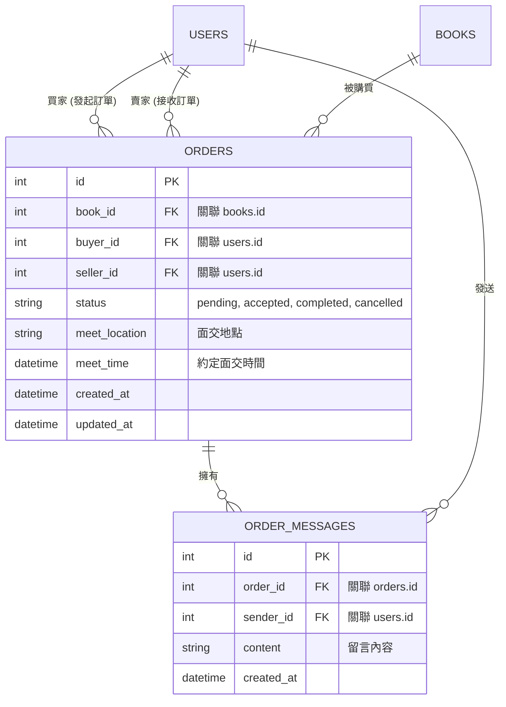

# 資料庫設計 (DB Design) - 訂單管理與追蹤模組

本文件依據流程圖與系統架構，定義「訂單管理與追蹤」模組的底層資料結構，包含實體關聯圖 (ER Diagram) 與資料表詳細設計。

## 1. 實體關係圖 (ER Diagram)

此圖展示了訂單模組核心的資料表，以及與使用者 (`users`) 和書籍 (`books`) 之間的關聯。

## 2. 資料表詳細說明

### 2.1 訂單資料表 (`orders`)
負責記錄每一筆交易的狀態與面交資訊。

| 欄位名稱 | 型別 | 必填 | 說明 |
| --- | --- | --- | --- |
| `id` | INTEGER | 是 | 系統流水號 (Primary Key) |
| `book_id` | INTEGER | 是 | 對應購買的書籍 ID (Foreign Key) |
| `buyer_id` | INTEGER | 是 | 發起購買請求的買家 ID (Foreign Key) |
| `seller_id` | INTEGER | 是 | 擁有該書籍的賣家 ID (Foreign Key) |
| `status` | TEXT | 是 | 訂單狀態：`pending` (待確認), `accepted` (進行中), `completed` (已完成), `cancelled` (已取消) |
| `meet_location` | TEXT | 否 | 雙方約定的面交地點 |
| `meet_time` | DATETIME | 否 | 雙方約定的面交時間 |
| `created_at` | DATETIME | 是 | 訂單建立時間 |
| `updated_at` | DATETIME | 是 | 訂單最後更新時間 |

### 2.2 訂單留言表 (`order_messages`)
負責記錄買賣雙方在訂單頁面中的即時通訊留言。

| 欄位名稱 | 型別 | 必填 | 說明 |
| --- | --- | --- | --- |
| `id` | INTEGER | 是 | 留言流水號 (Primary Key) |
| `order_id` | INTEGER | 是 | 該留言所屬的訂單 ID (Foreign Key) |
| `sender_id` | INTEGER | 是 | 發送此留言的使用者 ID (買家或賣家) |
| `content` | TEXT | 是 | 留言文字內容 |
| `created_at` | DATETIME | 是 | 留言發布時間 |

## 3. SQL 建表語法
實體檔案儲存於 `database/schema.sql`，請見該檔案以獲取完整的 `CREATE TABLE` 語法。

## 4. Python Model 程式碼
實體檔案儲存於 `app/models/order.py`，使用 `sqlite3` 進行封裝，提供給 Controller (`routes`) 呼叫。
