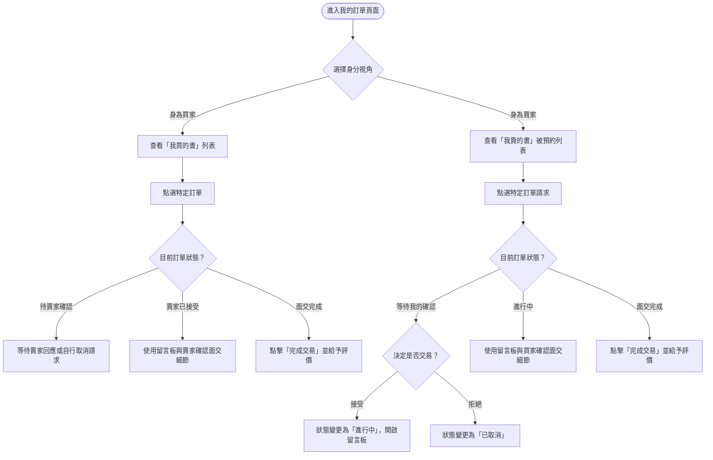
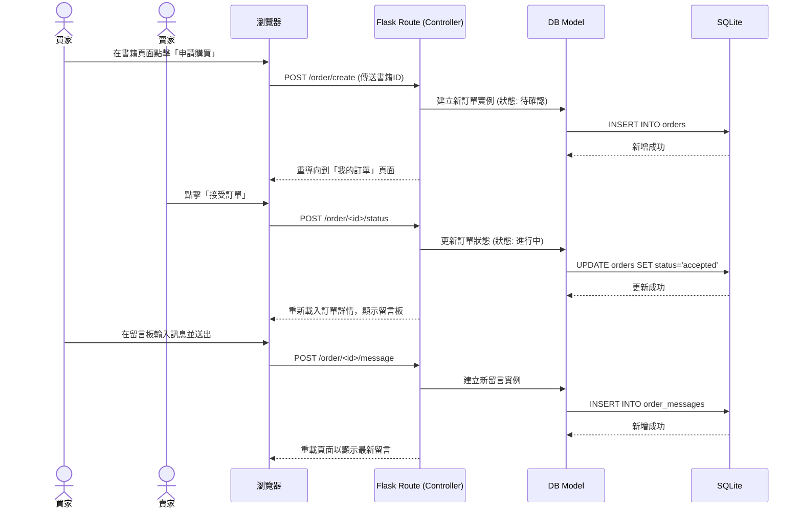

# 流程圖設計 (Flowchart) - 訂單管理與追蹤模組

本文件依據 PRD 與系統架構，針對你負責的**「訂單管理與追蹤」**模組進行流程規劃與視覺化。

## 1. 使用者流程圖（User Flow）

我們將從買家與賣家的雙重視角出發，描繪處理一筆訂單時，使用者會經歷的完整生命週期與操作路徑。

## 2. 系統序列圖（Sequence Diagram）

此序列圖描述「買家發起購買請求，賣家接受並與買家留言」的系統後端資料互動流程。

## 3. 功能清單與路由對照表

針對你負責的訂單模組 (`app/routes/order.py`)，以下是預計實作的 API 與頁面路由清單：

| 功能名稱 | URL 路徑 | HTTP 方法 | 說明 |
| --- | --- | --- | --- |
| 訂單列表頁 | `/orders` | GET | 渲染買/賣雙方的所有訂單列表 |
| 建立訂單請求 | `/order/create` | POST | 買家在書籍頁面點擊購買時觸發，建立訂單 |
| 訂單詳情頁 | `/order/<int:order_id>` | GET | 渲染單筆訂單的詳細資訊（含留言板） |
| 更新訂單狀態 | `/order/<int:order_id>/status` | POST | 賣家更改訂單狀態 (接受/拒絕)，或買賣雙方標記交易完成 |
| 新增留言 | `/order/<int:order_id>/message` | POST | 於特定訂單的留言板中新增一則訊息 |
